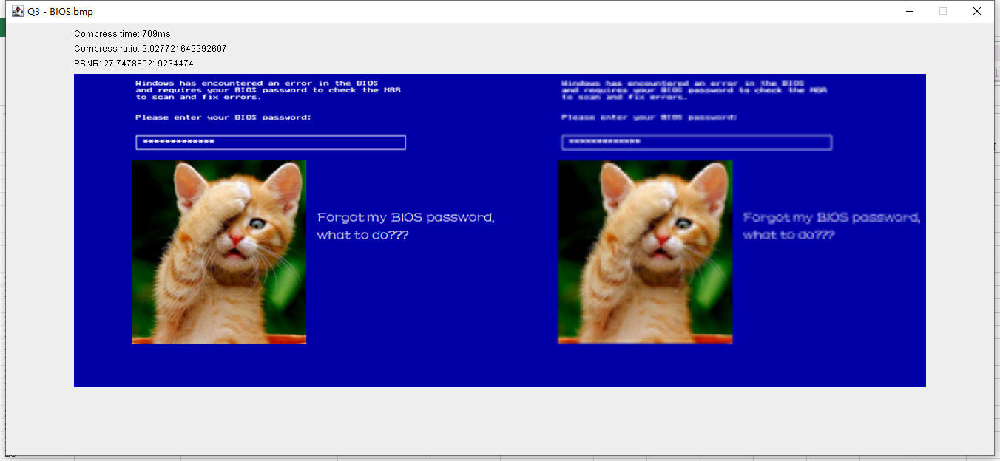
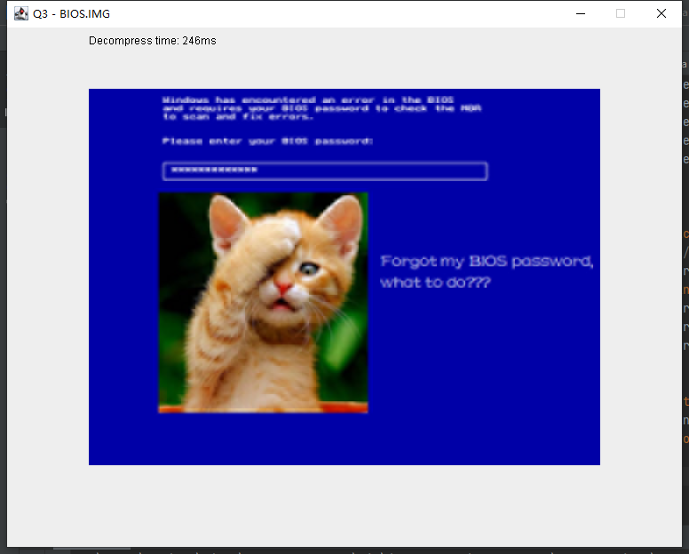

# bmp_Reader

## Key Feature
* Huffman compress
* DCT(Discrete cosine transform)

## Function
* Read .bmp file and use DCT and Huffman to compress, output .IMG file and display on interface.

* Read .IMG file and display on interface.

